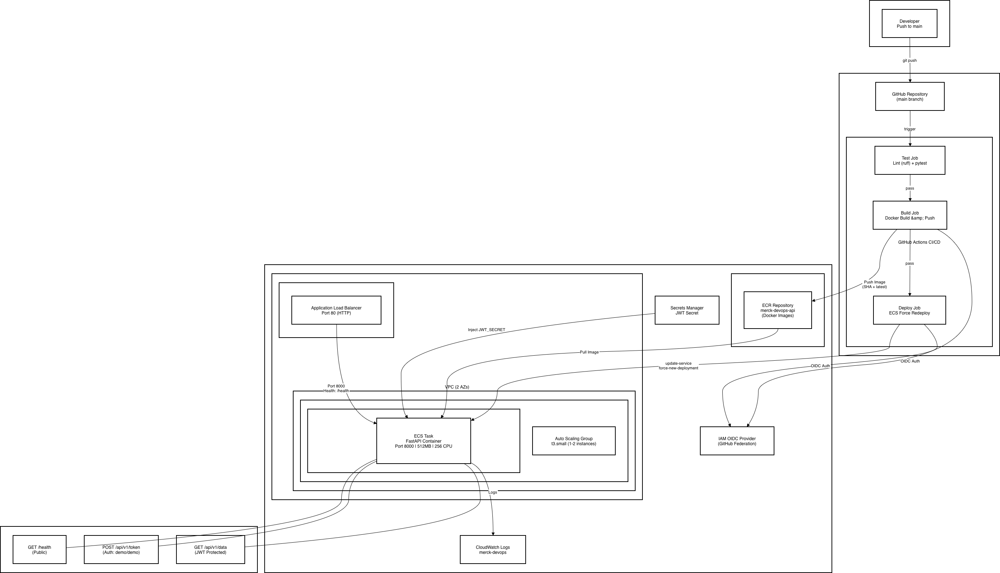

# Merck DevOps API

Python REST API with AWS deployment pipeline. Built with FastAPI, containerized with Docker, deployed to AWS ECS via GitHub Actions CI/CD.

## Architecture



- **VPC** with public and private subnets across 2 AZs
- **ECR** repository for Docker images
- **ECS on EC2** (t3.small) with auto-scaling group
- **ALB** internet-facing load balancer with health checks
- **Secrets Manager** for JWT secret management
- **GitHub Actions** CI/CD pipeline (test, build, deploy)

## Prerequisites

- [AWS CLI](https://docs.aws.amazon.com/cli/latest/userguide/install-cliv2.html) installed and configured (`aws configure`)
- [AWS CDK](https://docs.aws.amazon.com/cdk/v2/guide/getting-started.html) installed (`npm install -g aws-cdk`)
- [Docker](https://docs.docker.com/get-docker/) installed
- Python 3.9+
- A GitHub repository with the code pushed to `main`

## Deployment Steps

### Step 1: Bootstrap CDK (one-time)

If you've never used CDK in your AWS account/region, bootstrap it first:

```bash
cdk bootstrap aws://<YOUR_ACCOUNT_ID>/us-east-1
```

To get your account ID:

```bash
aws sts get-caller-identity --query Account --output text
```

### Step 2: Deploy Infrastructure

```bash
cd infra
pip install -r requirements.txt
cdk synth    # Preview the CloudFormation template
cdk deploy   # Deploy infrastructure (confirm when prompted)
```

This creates the VPC, ECR, ECS cluster, ALB, Secrets Manager, and all supporting resources. The ECS service starts with 0 tasks (no image in ECR yet).

### Step 3: Push Docker Image and Start Service

From the **project root** (not `infra/`):

```bash
./scripts/initial-deploy.sh
```

This script:
1. Gets the ECR repository URI
2. Logs in to ECR
3. Builds the Docker image for linux/amd64
4. Pushes to ECR
5. Scales the ECS service to 1 and forces a new deployment
6. Waits for the service to stabilize
7. Prints the ALB URL when ready

### Step 4: Set Up GitHub OIDC for CI/CD

This enables GitHub Actions to deploy automatically on every push to `main`.

**4a. Create GitHub OIDC Identity Provider in AWS:**

- Go to **IAM -> Identity Providers -> Add Provider**
- Provider type: **OpenID Connect**
- Provider URL: `https://token.actions.githubusercontent.com`
- Audience: `sts.amazonaws.com`

**4b. Create IAM Role for GitHub Actions:**

- Go to **IAM -> Roles -> Create Role**
- Trusted entity: **Web identity** -> select the OIDC provider you just created
- Condition: `token.actions.githubusercontent.com:sub` -> `repo:<YOUR_GITHUB_USERNAME>/merck-devops:ref:refs/heads/main`
- Attach these managed policies:
  - `AmazonEC2ContainerRegistryPowerUser` (ECR push)
  - `AmazonECS_FullAccess` (ECS deploy)
- Name the role (e.g., `github-actions-merck-devops`)
- Note the **Role ARN**

**4c. Configure GitHub Repository Secrets and Variables:**

In your GitHub repo -> **Settings -> Secrets and variables -> Actions**:

| Type | Name | Value |
|------|------|-------|
| Secret | `AWS_ROLE_ARN` | IAM role ARN from step 4b |
| Variable | `ECR_REGISTRY` | ECR registry URL (e.g., `654654351126.dkr.ecr.us-east-1.amazonaws.com`) |
| Variable | `ECR_REPOSITORY` | `merck-devops-api` |

### Step 5: Verify CI/CD

Push a commit to `main`. The GitHub Actions pipeline will automatically:

1. **Test** -- lint (ruff), format check, pytest
2. **Build** -- Docker build and push to ECR (tagged with commit SHA + latest)
3. **Deploy** -- force new ECS deployment

Monitor progress in the **Actions** tab of your GitHub repository.

## Testing the API

After successful deployment, get the ALB DNS name:

```bash
aws elbv2 describe-load-balancers \
  --query "LoadBalancers[?contains(LoadBalancerName,'Merck')].DNSName" \
  --output text
```

### Health Check (no authentication required)

```bash
curl http://<ALB_DNS>/health
```

Expected response:

```json
{"status": "healthy", "version": "1.0.0"}
```

### Get a JWT Token

```bash
curl -X POST http://<ALB_DNS>/api/v1/token \
  -H "Content-Type: application/json" \
  -d '{"username": "demo", "password": "demo"}'
```

Expected response:

```json
{"access_token": "eyJhbGciOiJIUzI1NiIs...", "token_type": "bearer"}
```

### Access Protected Data (requires token)

```bash
curl http://<ALB_DNS>/api/v1/data \
  -H "Authorization: Bearer <TOKEN_FROM_ABOVE>"
```

Expected response:

```json
{
  "items": [
    {"id": 1, "name": "Widget A", "description": "High-performance widget", "category": "widgets"},
    {"id": 2, "name": "Gadget B", "description": "Multi-purpose gadget", "category": "gadgets"},
    {"id": 3, "name": "Tool C", "description": "Precision engineering tool", "category": "tools"}
  ],
  "total": 3
}
```

### Verify Without Token (should return 403)

```bash
curl http://<ALB_DNS>/api/v1/data
```

Expected response:

```json
{"detail": "Not authenticated"}
```

## Troubleshooting

### `cdk deploy` hangs

The ECS service starts with `desired_count=0` to avoid this. If it still hangs, check CloudFormation status:

```bash
aws cloudformation describe-stacks --stack-name MerckDevOpsStack \
  --query 'Stacks[0].StackStatus' --output text
```

### ECS task not starting (Running: 0)

Check the latest stopped task for the failure reason:

```bash
aws ecs list-tasks --cluster MerckDevOpsStack-Cluster --desired-status STOPPED \
  --query 'taskArns[0]' --output text

aws ecs describe-tasks --cluster MerckDevOpsStack-Cluster \
  --tasks <TASK_ARN> \
  --query 'tasks[0].{StopReason:stoppedReason,ContainerReason:containers[0].reason}' \
  --output json
```

Common causes:
- **`CannotPullContainerError: no matching manifest for linux/amd64`** -- Image was built on ARM (Apple Silicon Mac). Rebuild with `--platform linux/amd64`.
- **`CannotPullContainerError: repository does not exist`** -- No image pushed to ECR. Run `./scripts/initial-deploy.sh`.

### ALB returns 504 Gateway Timeout

The ALB can't reach the container on port 8000. Check target health:

```bash
aws elbv2 describe-target-groups \
  --query "TargetGroups[?contains(TargetGroupName,'Merck')].TargetGroupArn" \
  --output text

aws elbv2 describe-target-health --target-group-arn <TARGET_GROUP_ARN>
```

Common causes:
- **`Target.Timeout`** -- Security group not allowing traffic on port 8000. Verify the EC2 instance security group has an inbound rule from the ALB on port 8000.
- Container is still starting -- wait 30-60 seconds and try again.

### `cdk destroy` hangs

ECS capacity provider may have scale-in protection enabled on EC2 instances. Check and remove it:

```bash
# Find the instance
aws autoscaling describe-auto-scaling-groups \
  --query "AutoScalingGroups[?contains(AutoScalingGroupName,'MerckDevOps')].[AutoScalingGroupName,Instances[*].InstanceId]" \
  --output json

# Remove scale-in protection
aws autoscaling set-instance-protection \
  --auto-scaling-group-name <ASG_NAME> \
  --instance-ids <INSTANCE_ID> \
  --no-protected-from-scale-in
```

### GitHub Actions build fails

- Verify `AWS_ROLE_ARN` secret is set correctly in GitHub
- Verify `ECR_REGISTRY` and `ECR_REPOSITORY` variables are set
- Check the OIDC trust policy on the IAM role matches your repo name and branch

### Checking ECS service events

```bash
aws ecs describe-services --cluster MerckDevOpsStack-Cluster \
  --services MerckDevOpsStack-Service \
  --query 'services[0].events[0:5].[message]' --output table
```

### Checking container logs

```bash
aws logs describe-log-groups --query "logGroups[?contains(logGroupName,'merck')].logGroupName" --output text

aws logs tail <LOG_GROUP_NAME> --since 1h
```

## Tear Down

To remove all AWS resources:

```bash
cd infra && cdk destroy
```

This deletes the entire stack (VPC, ECS, ECR, ALB, etc.). Note: the ECR repository and all images will be deleted.
